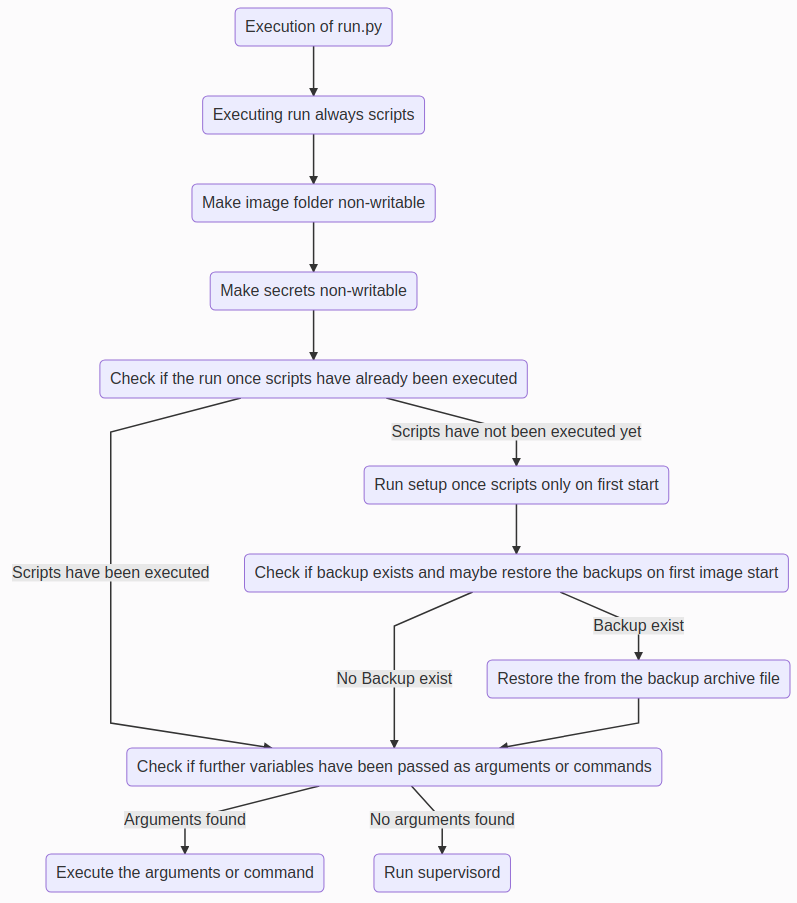

# Container Manager

[](https://github.com/ZPascal/container-manager/actions/workflows/integrationtest.yml)

## Idea

The finished solution should enable the complete lifecycle of an application to be covered and the application to be managed by means of a supervisor and corresponding preparatory steps to be carried out. Furthermore, one-time and regular operations are to be performed on the persistent storage. Another functionality is the backup and restore of the whole system. The system should be rounded off with the possibility of forwarding logs.

## Description

The Container Manager manages the lifecycle like the s6-overlay of your application and provides a framework for your container. This folder structure allows you to configure your application within a pre-built framework and equip it with all the services you need. The architecture of the framework gives you maximum flexibility. The framework presented here allows you to manage your app and reduce the maintenance effort to a minimum. It allows you to manage your app with a supervisor and automate all necessary steps like backup functionality. Furthermore, a restore mechanism is available in a fallback scenario. Other basic components are the two setup scripts (run.always and run.once), the central logging, Crontab and the integration of various health scripts that monitor the state of your application.

## Installation & Requirements

### Container

If you want to use the container manager, feel free to build it and use it accordingly. Furthermore, it is already planned to publish the corresponding container inside the Docker Hub.

### Manual installation

#### Programs & tools to install

- python3
- supervisor
- filebeat 
- tzdata 
- logrotate 
- rsync 
- curl
- py3-pip

#### Folder structure

Please copy the whole folder structure from the ```files``` directory to your system. You could use the following Dockerfile command for this task: ```ADD files /``` 

## Functionality & Folders

### Docker container

Inside the Docker container, you can find the already copied directory structure and additionally, various configurations such as a dedicated user for the corresponding applications have already been created and all scripts have been made executable. Furthermore, the image can be used as a mother and an inheritance with the corresponding children based on it. Thus, a later change of the user can be accomplished in the inheriting images (Add ```USER 500``` to the corresponding Dockerfile). Another special feature is the already included integration of the corresponding Alpine repositories (Main, Testing, Community) and recursively revoking write permissions inside the complete newly embedded directory structure.

#### Deployment of the container

The variables, e.g. for Filebeat/ Logstash, can be set centrally within the deployment and thus enable central control and processing of the logs and other configuration parameters.

| Environment variable | Value |
|:--------------------:|:-----:|
| IMAGE_NAME | Name of the image (this value can be used for later assignment and extension of the logrotate configuration) |
| IMAGE_VERSION | Version of the image (this value can be used for later assignment and extension of the logrotate configuration) |
| APP_NAME | Name of the app (this value can be used for later assignment and extension of the logrotate configuration) |
| APP_VERSION | Version of the app (this value can be used for later assignment and extension of the logrotate configuration) |
| TZ | The value of your corresponding timezone e.g. Europe/Berlin |

### App

Inside the app folder, the corresponding applications, their dependencies and other required files should be stored. This structure enables an orderly storage of the artifacts and the later backup of the applications.

### Backup

The backup folder contains the logic of the backup process in the form of a start script and any number of other scripts that describe the artifacts and files to be backed up.

### Config

The configuration files and corresponding initialization scripts of the corresponding applications can be stored centrally in the config folder.

### Cron

Inside the cron directory, the corresponding Python crontab implementation and a cron wrapper can be found. Furthermore, corresponding crontab entries such as the automatic execution of the backup job can be placed within the file ```kubernetes```. Please note the corresponding order of creation and have a look at the corresponding example [here](files/image/setup/run.always/01-configure-backup.py).

### Health scripts

#### Liveness

The centrally implemented health liveness scripts and their extensions within the subfolder regularly check the current status of the corresponding process application and whether it is still active accordingly. The intensity of the check can be configured via the ```IMAGE_HEALTH_CRON``` environment variable and define the execution interval of the health checks. Normally the corresponding supervisor application manages the app, but it's also possible to enable the on-top readiness checks via the ```IMAGE_HEALTH_LIVENESS_CHECK_ENABLED="true"``` env variable. The default value of that option is ```false```. If you enabled that opportunity on top of supervisor, it's possible to define a custom log file of the execution process of the cron job. You can define the ```IMAGE_HEALTH_LIVENESS_LOG``` env variable to set your favorite log file. To use that complete functionality it's necessary to enable and set up the cron application (default setting).

#### Readiness

Furthermore, in this context, the already implemented health readiness scripts are located in the same directory structure. These scripts can directly query the current status of the corresponding application using the extensions to be created within the subfolder and, for example, trigger an API call to a connected health interface. The intensity of the check can be also configured via the ```IMAGE_HEALTH_CRON``` environment variable and define the execution interval of booth health checks. It's only possible to define one value for both checks (if both are enabled). Another configuration parameter is the env variable ```IMAGE_HEALTH_READINESS_FORCE_REBOOT="true"``` and it defines the reboot of the application if the health point not available. It's necessary to set the value to ```true``` or ```false```, the corresponding default value is ```true```. It's possible to define a custom log file of the execution process of the corresponding cron job. You can define the ```IMAGE_HEALTH_READINESS_LOG``` env variable to set your favorite log file. To use that complete functionality it's necessary to enable and set up the cron application (default setting).

### Logging

Within this folder, the global settings of Filebeat and Logrotate can be adjusted. Furthermore, it is possible to override the global settings by configuration files (within the configuration files in the subfolder) and to integrate corresponding applications into the circuit of the two applications. A special feature in this context is the default configuration of Filebeat. Here the appropriate settings were selected in such a way that all logs within the Supervisor folder are passed on according to the configuration set before by the two mostly in the Deployment defined parameters(`LOGGING_REDIS_HOST` and `LOGGING_REDIS_PASSWORD`) centrally (The Redis scenario acts for this as cache).

### Restore

The restore folder structure contains the counterpart to the backup structure and can be equipped with its own scripts inside the subfolder. These scripts can be used to customize the restore process and to rebuild the saved files.

### Secrets

The secret folder has the purpose of storing required secrets centrally.

### Setup scripts

#### Run always

Within this folder scripts can be created, which are executed at a container start and which should carry out corresponding initializations or configurations within the container. Furthermore, the configuration of the backup cron job and logrotate is carried out by default. A further point is the backup, examination, and embedding of the environment within the configuration folder. The integration of this created file within the backup and lograte cron entry is also done within this directory structure.

#### Run once (normally on the first container start)

In this folder, scripts can be created which are to be executed once during a container start and which are to carry out corresponding initializations or configurations within the container. After the scripts have been executed, a corresponding shadow file is created and checked accordingly when the container is started again and as a result, the execution of the scripts is skipped.

### Supervisor

The supervisor daemon enables the central control and monitoring of the appropriately configured applications. A special aspect is the control and renewal of the application after an internal error or shutdown of the functions. This functionality is supported and controlled by various functions, e.g. the regular execution of health scripts. Furthermore, the supervisord process writes the corresponding process ID and the state of all configured applications inside the ```/tmp``` directory.

## Architecture overview & process flow

The starting point of the overlay system is the file [run.py](files/run.py). Within this file, all appropriate files are controlled and executed within subprocesses (apart from the supervisord process). In this context, the file [utils.py](files/image/utils.py) represents a collection of centrally needed auxiliary methods, which can be used within all scripts after the appropriate integration. The process flow can be seen in the graphic below.



## Examples

Inside the [example](examples) folder you will find different configuration ideas and files from my productive containers. The configuration files should give you some ideas of what is possible with this construction and can be completed by your suggestions. The structure inside this folder is the same as you can find inside the container.

## Contribution

If you would like to contribute a sample script [here](examples), have an improvement request, or want to make a change inside the code, please open a pull request.

## Support

If you need support, or you encounter a bug, please don't hesitate to open an issue.

## Donations

If you want to support my work, I ask you to take an unusual action inside the open source community. Donate the money to a non-profit organization like Doctors Without Borders or the Children's Cancer Aid. I will continue to build tools because I like them, and I am passionate about developing and sharing applications.

## License

This product is available under the Apache 2.0 [license](LICENSE).
