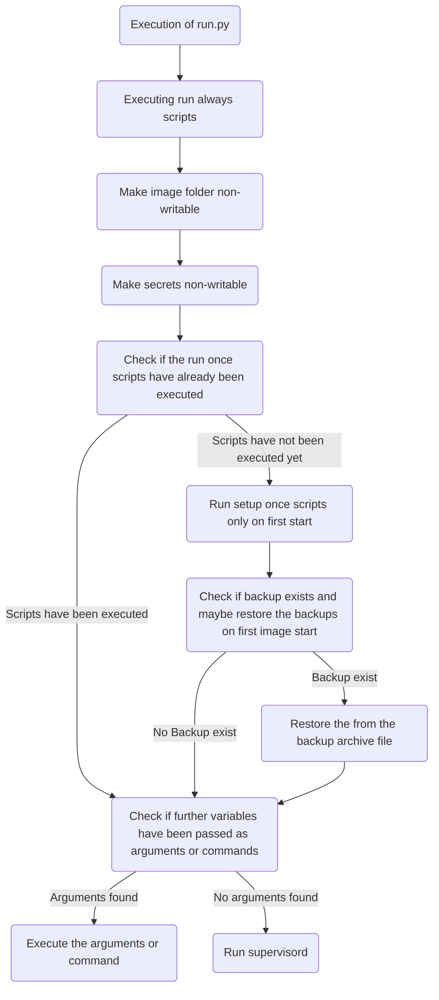

```mermaid
graph TD;
    A(Execution of run.py)-->B;
    B(Executing run always scripts)-->C;
    C(Make image folder non-writable)-->D;
    D(Make secrets non-writable)-->E
    E(Check if the run once scripts have already been executed)-- Scripts have not been executed yet -->F
    E-- Scripts have been executed -->J
    F(Run setup once scripts only on first start)-->G
    G(Check if backup exists and maybe restore the backups on first image start)-- Backup exist -->H
    G-- No Backup exist --> J
    H(Restore the from the backup archive file)-->J;
    J(Check if further variables have been passed as arguments or commands) -- Arguments found -->K
    K(Execute the arguments or command)
    J-- No arguments found -->L
    L(Run supervisord)
```